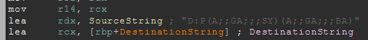
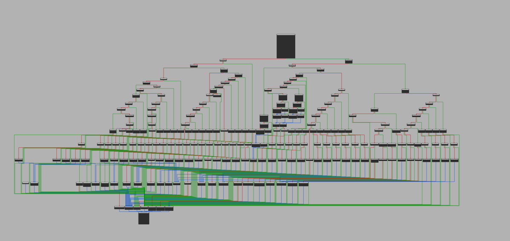

# imMapper
- A Demonstration on how to abuse the Vulnerable Driver AmdTools64. The Driver has the ability to (only) Read/Write Kernel Space Memory, as well as to Read/Write the MSR. This requires Admin Privileges. The driver is distributed trough the tool [RGBFusion-2](https://www.gigabyte.com/microsite/512/rgb2.html).

## Exclamation-mark
- This Demonstration is only for Learning Purposes, and I Discourage the Misuse of this vulnerability, as of 8/25/2026 there is no valid CVE and is not in progress, any future CVE will not be of the original author, me.

## Question-mark
- I came upon this driver after looking through older dm's on discord, ive found an interesting dm of [sigwl](https://github.com/sigwl) showcasing me his vulnerable driver called "RGBMini", this got me researching for other possible vulnerable driver in such theme.
- At the address 0x140005380 the device object is registered with the SDDL D:P(A;;GA;;;SY)(A;;GA;;;BA), which means only the system and admins can open a handle. The Dispatch Handler at 0x1400058D8, the Vulnerability lies in it. It gives the usermode the parameters of dangerous operations, like when reading and writing physical memory instead of range and size checking, nothing is validated and everything is usermode passed.

## Add
- [IDA](https://hex-rays.com/ida-pro)

## At
- I'm crediting [Leo](https://github.com/KiUserExceptionDispatcher) for helping me with the utilities of this project.
